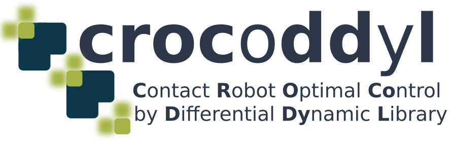

<p align="center">
  
</p>

##  Introduction


**[Crocoddyl](https://cmastalli.github.io/publications/crocoddyl20icra.html)** is an optimal control library for robot control under contact sequence.
Its solvers are based on novel and efficient Differential Dynamic Programming (DDP) algorithms.
**Crocoddyl** computes optimal trajectories along with optimal feedback gains.
It uses **[Pinocchio](https://github.com/stack-of-tasks/pinocchio)** for fast computation of robots dynamics and their analytical derivatives.


The source code is released under the [BSD 3-Clause license](LICENSE).

**Authors:** [Carlos Mastalli](https://cmastalli.github.io/) and [Rohan Budhiraja](https://scholar.google.com/citations?user=NW9Io9AAAAAJ) <br />
**Instructors:** Nicolas Mansard <br />
**With additional support from the Gepetto team at LAAS-CNRS and MEMMO project. For more details see Section Credits**

[](https://tldrlegal.com/license/bsd-3-clause-license-%28revised%29#fulltext)
[](https://travis-ci.org/loco-3d/crocoddyl)
[](https://gepgitlab.laas.fr/loco-3d/crocoddyl/pipelines?ref=devel)
[](https://gepettoweb.laas.fr/doc/loco-3d/crocoddyl/devel/coverage/)
[](https://gepgitlab.laas.fr/loco-3d/crocoddyl/-/tags)
[](https://img.shields.io/github/repo-size/loco-3d/crocoddyl)
[](https://anaconda.org/conda-forge/crocoddyl)
[](https://anaconda.org/conda-forge/crocoddyl)
[](https://anaconda.org/conda-forge/crocoddyl)
[](https://github.com/loco-3d/crocoddyl/graphs/contributors)
[](https://img.shields.io/github/release-date/loco-3d/crocoddyl)
[](https://img.shields.io/github/last-commit/loco-3d/crocoddyl)

If you want to follow the current developments, you can directly refer to the [devel branch](https://github.com/loco-3d/cddp/tree/devel).
If you want to directly dive into **Crocoddyl**, only one single line is sufficient (assuming you have Conda):

<p align="center">
conda install crocoddyl -c conda-forge 
<\p>
  
##  Installation
**Crocoddyl** can be easily installed on various Linux (Ubuntu, Fedora, etc.) and Unix distributions (Mac OS X, BSD, etc.).

## Crocoddyl features
<table >
  <tr>
    <td align="left"></td>
    <td align="right"> </td>
  </tr>
</table>

**Crocoddyl** is versatible:

 * various optimal control solvers (DDP, FDDP, BoxDDP, etc) - single and multi-shooting methods
 * analytical and sparse derivatives via **[Pinocchio](https://github.com/stack-of-tasks/pinocchio)**
 * Euclidian and non-Euclidian geometry friendly via **[Pinocchio](https://github.com/stack-of-tasks/pinocchio)**
 * handle autonomous and nonautomous dynamical systems
 * numerical differentiation support
 * automatic differentiation support via **[CppAD](https://github.com/coin-or/CppAD)**

**Crocoddyl** is efficient and flexible:

 * cache friendly,
 * multi-thread friendly
 * Python bindings (including models and solvers abstractions) via **[Boost Python](https://wiki.python.org/moin/boost.python)**
 * C++ 98/11/14/17/20 compliant
 * extensively tested
 * automatic code generation support via **[CppADCodeGen](https://github.com/joaoleal/CppADCodeGen)**

### Installation through robotpkg

You can install this package through robotpkg. robotpkg is a package manager tailored for robotics softwares.
It greatly simplifies the release of new versions along with the management of their dependencies.
You just need to add the robotpkg apt repository to your sources.list and then use `sudo apt install robotpkg-py27-crocoddyl` (or `py3X` for python 3.X, depending on your system):

If you have never added robotpkg as a softwares repository, please follow first the instructions from 1 to 3; otherwise, go directly to instruction 4.
Those instructions are similar to the installation procedures presented in [http://robotpkg.openrobots.org/debian.html](http://robotpkg.openrobots.org/debian.html).

1. Add robotpkg as source repository to apt:

```bash
sudo tee /etc/apt/sources.list.d/robotpkg.list <<EOF
deb [arch=amd64] http://robotpkg.openrobots.org/wip/packages/debian/pub $(lsb_release -sc) robotpkg
deb [arch=amd64] http://robotpkg.openrobots.org/packages/debian/pub $(lsb_release -sc) robotpkg
EOF
```

2. Register the authentication certificate of robotpkg:

```bash
curl http://robotpkg.openrobots.org/packages/debian/robotpkg.key | sudo apt-key add -
```

3. You need to run at least once apt update to fetch the package descriptions:

```bash
sudo apt-get update
```

4. The installation of Crocoddyl:

```bash
sudo apt install robotpkg-py27-crocoddyl # for Python 2

sudo apt install robotpkg-py36-crocoddyl # for Python 3
```

Finally you will need to configure your environment variables, e.g.:

```bash
export PATH=/opt/openrobots/bin:$PATH
export PKG_CONFIG_PATH=/opt/openrobots/lib/pkgconfig:$PKG_CONFIG_PATH
export LD_LIBRARY_PATH=/opt/openrobots/lib:$LD_LIBRARY_PATH
export PYTHONPATH=/opt/openrobots/lib/python2.7/site-packages:$PYTHONPATH
```


### Building from source

**Crocoddyl** is c++ library with Python bindings for versatile and fast prototyping. It has the following dependencies:

* [pinocchio](https://github.com/stack-of-tasks/pinocchio)
* [Eigen](http://eigen.tuxfamily.org/index.php?title=Main_Page)
* [eigenpy](https://github.com/stack-of-tasks/eigenpy)
* [Boost](https://www.boost.org/)
* [example-robot-data](https://github.com/gepetto/example-robot-data) (optional for examples, install Python loaders)
* [OpenMP](https://www.openmp.org/) (optional for multi-threading installation)
* [gepetto-viewer-corba](https://github.com/Gepetto/gepetto-viewer-corba) (optional for display)
* [jupyter](https://jupyter.org/) (optional for notebooks)
* [matplotlib](https://matplotlib.org/) (optional for examples)


You can run examples, unit-tests and benchmarks from your build dir:

```bash
cd build
make test
make -s examples-quadrupedal_gaits INPUT="display plot" # enable display and plot
make -s benchmarks-cpp-quadrupedal_gaits INPUT="100 walk" # number of trials ; type of gait
```

Alternatively, you can see the 3D result and/or graphs of your run examples (through gepetto-viewer and matplotlib), you can use

```bash
export CROCODDYL_DISPLAY=1
export CROCODDYL_PLOT=1
```

After installation, you could run the examples as follows:

```bash
python -m crocoddyl.examples.quadrupedal_gaits "display" "plot" # enable display and plot
```

If you want to learn about Crocoddyl, take a look at the Jupyter notebooks. Start in the following order.
- [examples/notebooks/unicycle_towards_origin.ipynb](https://github.com/loco-3d/crocoddyl/blob/master/examples/notebooks/unicycle_towards_origin.ipynb)
- [examples/notebooks/cartpole_swing_up.ipynb](https://github.com/loco-3d/crocoddyl/blob/master/examples/notebooks/cartpole_swing_up.py)
- [examples/notebooks/arm_manipulation.ipynb](https://github.com/loco-3d/crocoddyl/blob/master/examples/notebooks/arm_manipulation.ipynb)
- [examples/notebooks/whole_body_manipulation.ipynb](https://github.com/loco-3d/crocoddyl/blob/master/examples/notebooks/whole_body_manipulation.ipynb)
- [examples/notebooks/bipedal_walking.ipynb](https://github.com/loco-3d/crocoddyl/blob/master/examples/notebooks/bipedal_walking.ipynb)
- [examples/notebooks/introduction_to_crocoddyl.ipynb](https://github.com/loco-3d/crocoddyl/blob/master/examples/notebooks/introduction_to_crocoddyl.ipynb)

## Documentation

The documentation of **Crocoddyl** of its last release is available [here](https://gepettoweb.laas.fr/doc/loco-3d/crocoddyl/master/doxygen-html/).

## Citing Crocoddyl

To cite **Crocoddyl** in your academic research, please use the following bibtex lines:
```bibtex
@inproceedings{mastalli20crocoddyl,
  author={Mastalli, Carlos and Budhiraja, Rohan and Merkt, Wolfgang and Saurel, Guilhem and Hammoud, Bilal
  and Naveau, Maximilien and Carpentier, Justin and Righetti, Ludovic and Vijayakumar, Sethu and Mansard, Nicolas},
  title={{Crocoddyl: An Efficient and Versatile Framework for Multi-Contact Optimal Control}},
  booktitle = {IEEE International Conference on Robotics and Automation (ICRA)},
  year={2020}
}
```
and the following one to reference this website:
```bibtex
@misc{crocoddylweb,
   author = {Carlos Mastalli, Rohan Budhiraja and Nicolas Mansard and others},
   title = {Crocoddyl: a fast and flexible optimal control library for robot control under contact sequence},
   howpublished = {https://github.com/loco-3d/crocoddyl/wikis/home},
   year = {2019}
}
```

**Crocoddyl** contributions go beyond efficient software implementation as well. Please also consider to cite the algorithm contributions of our different solvers and formulations:
 - Feasibility-driven DDP (FDDP): [[1]](#1)
 - Control-limited feasibility-driven DDP (Box-FDDP): [[2]](#2)
 - Multi-phase rigid optimal control: [[3]](#3)


Finally, pllease also consider citing **[Pinocchio](https://github.com/stack-of-tasks/pinocchio)**, which contributes to the efficient implementation of rigid body algorithms and their derivatives. For more details how to cite Pinocchio visit: [https://github.com/stack-of-tasks/pinocchio](https://github.com/stack-of-tasks/pinocchio).

Below, there is list of the selected publications that describe different components of **Crocoddyl**. For a complete list see [PUBLICATIONS.md](https://github.com/loco-3d/crocoddyl/blob/master/PUBLICATIONS.md).


### Selected publications
<a id="1">[1]</a>
C. Mastalli, R. Budhiraja, W. Merkt, G. Saurel, B. Hammoud, M. Naveau, J. Carpentier, L. Righetti, S. Vijayakumar and N. Mansard. [Crocoddyl: An Efficient and Versatile Framework for Multi-Contact Optimal Control](https://cmastalli.github.io/publications/crocoddyl20icra.html), IEEE International Conference on Robotics and Automation (ICRA), 2020

<a id="2">[2]</a>
C. Mastalli, W. Merkt, J. Marti-Saumell, H. Ferrolho, J. Sola, N. Mansard, S. Vijayakumar. [A Direct-Indirect Hybridization Approach to Control-Limited DDP](https://arxiv.org/pdf/2010.00411.pdf), 2021

<a id="3">[3]</a>
R. Budhiraja, J. Carpentier, C. Mastalli and N. Mansard. [Differential Dynamic Programming for Multi-Phase Rigid Contact Dynamics](https://cmastalli.github.io/publications/mddp18.html), IEEE RAS International Conference on Humanoid Robots (ICHR), 2018


## Questions and Issues

You have a question or an issue? You may either directly open a [new issue](https://github.com/loco-3d/crocoddyl/issues) or use the mailing list <crocoddyl@laas.fr>.


## Steering Committee

**Crocoddyl** is being managed by a steering committee which meets every two weeks to discuss the ongoing developments.

The committee is being led by [Carlos Mastalli](https://cmastalli.github.io/) (University of Edinburgh) and [Rohan Budhiraja](https://scholar.google.com/citations?user=NW9Io9AAAAAJ) (LAAS-CNRS).
[Nicolas Mansard](http://projects.laas.fr/gepetto/index.php/Members/NicolasMansard) (LAAS-CNRS), [Guilhem Saurel](http://projects.laas.fr/gepetto/index.php/Members/GuilhemSaurel) (LAAS-CNRS) and [Justin Carpentier](https://jcarpent.github.io/) (INRIA) are other members of the committee.


## Credits

The following people have been involved in the development of **Crocoddyl**:

- [Nicolas Mansard](http://projects.laas.fr/gepetto/index.php/Members/NicolasMansard) (LAAS-CNRS): project instructor and main developer
- [Carlos Mastalli](https://cmastalli.github.io/) (University of Edinburgh): main developer
- [Rohan Budhiraja](https://scholar.google.com/citations?user=NW9Io9AAAAAJ) (LAAS-CNRS): main developer
- [Justin Carpentier](https://jcarpent.github.io/) (INRIA): efficient analytical rigid-body dynamics derivatives, conda integration
- [Maximilien Naveau](https://scholar.google.fr/citations?user=y_-cGlUAAAAJ&hl=fr) (MPI): unit-test support
- [Guilhem Saurel](http://projects.laas.fr/gepetto/index.php/Members/GuilhemSaurel) (LAAS-CNRS): continuous integration and deployment
- [Wolfgang Merkt](http://www.wolfgangmerkt.com/research/) (University of Oxford): feature extension and debugging
- [Josep Martí Saumell](https://www.iri.upc.edu/staff/jmarti) (IRI: CSIC-UPC): feature extension
- [Bilal Hammoud](https://scholar.google.com/citations?hl=en&user=h_4NKpsAAAAJ) (MPI): features extension
- [Julian Eßer](https://github.com/julesser) (DFKI): features extension (contact stability)


## Acknowledgments

The development of **Crocoddyl** is supported by the [EU MEMMO project](http://www.memmo-project.eu/), and the [EU RoboCom++ project](http://robocomplusplus.eu/).
It is maintained by the [Gepetto team](http://projects.laas.fr/gepetto/) [@LAAS-CNRS](http://www.laas.fr), and the [Statistical Machine Learning and Motor Control Group](http://wcms.inf.ed.ac.uk/ipab/slmc) [@University of Edinburgh](https://www.edinburgh-robotics.org/).
